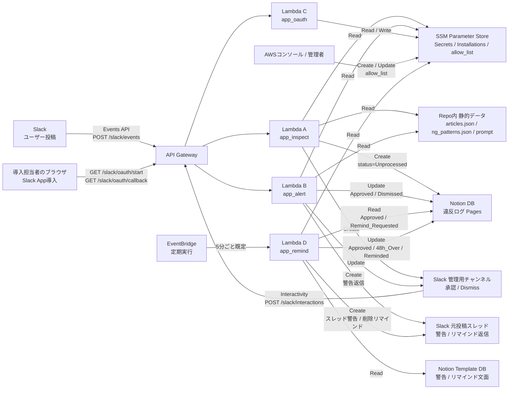
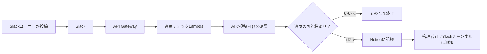
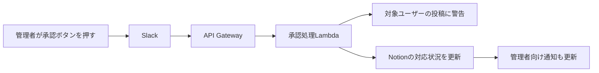
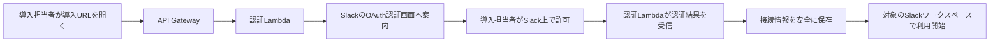
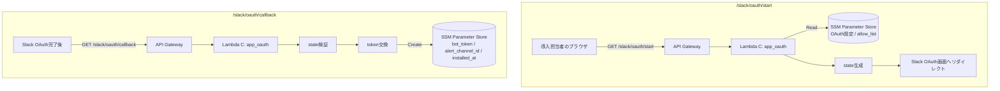

## 簡易的なアーキテクチャ図

全体図

```mermaid
flowchart LR
  Slack["Slack<br/>ユーザー投稿"]
  Admin["Slack 管理用チャンネル<br/>承認 / Dismiss"]
  Installer["導入担当者のブラウザ<br/>Slack App導入"]
  AWSAdmin["AWSコンソール / 管理者"]

  APIGW["API Gateway"]
  EB["EventBridge<br/>定期実行"]

  LA["Lambda A<br/>app_inspect"]
  LB["Lambda B<br/>app_alert"]
  LC["Lambda C<br/>app_oauth"]
  LD["Lambda D<br/>app_remind"]

  SSM["SSM Parameter Store<br/>Secrets / Installations / allow_list"]
  RepoData["Repo内 静的データ<br/>articles.json / ng_patterns.json / prompt"]
  Notion["Notion DB<br/>違反ログ Pages"]
  TemplateDB["Notion Template DB<br/>警告 / リマインド文面"]
  WarnMsg["Slack 元投稿スレッド<br/>警告 / リマインド返信"]

  Slack -->|"Events API<br/>POST /slack/events"| APIGW
  APIGW --> LA
  LA -->|"Read"| SSM
  LA -->|"Read"| RepoData
  LA -->|"Create<br/>status=Unprocessed"| Notion
  LA -->|"Create"| Admin

  Admin -->|"Interactivity<br/>POST /slack/interactions"| APIGW
  APIGW --> LB
  LB -->|"Read"| SSM
  LB -->|"Read"| RepoData
  LB -->|"Update<br/>Approved / Dismissed"| Notion
  LB -->|"Update"| Admin
  LB -->|"Create<br/>警告返信"| WarnMsg

  Installer -->|"GET /slack/oauth/start<br/>GET /slack/oauth/callback"| APIGW
  APIGW --> LC
  LC -->|"Read / Write"| SSM

  AWSAdmin -->|"Create / Update<br/>allow_list"| SSM

  EB -->|"5分ごと既定"| LD
  LD -->|"Read"| SSM
  LD -->|"Read<br/>Approved / Remind_Requested"| Notion
  LD -->|"Read"| TemplateDB
  LD -->|"Update<br/>Approved / 48h_Over / Reminded"| Notion
  LD -->|"Create<br/>スレッド警告 / 削除リマインド"| WarnMsg
```

違反投稿→通知まで

```mermaid
flowchart LR
    A[Slackユーザーが投稿] --> B[Slack]
    B --> C[API Gateway]
    C --> D[違反チェックLambda]

    D --> E[AIで投稿内容を確認]
    E --> F{違反の可能性あり？}

    F -- いいえ --> G[そのまま終了]
    F -- はい --> H[Notionに記録]
    H --> I[管理者向けSlackチャンネルに通知]
```

通知確認→承認まで

```mermaid
flowchart LR
    A[管理者が承認ボタンを押す] --> B[Slack]
    B --> C[API Gateway]
    C --> D[承認処理Lambda]

    D --> E[対象ユーザーの投稿に警告]
    D --> F[Notionの対応状況を更新]
    F --> G[管理者向け通知も更新]
```

他WSへの導入

```mermaid
flowchart LR
    A[導入担当者が導入URLを開く] --> B[API Gateway]
    B --> C[認証Lambda]

    C --> D[SlackのOAuth認証画面へ案内]
    D --> E[導入担当者がSlack上で許可]
    E --> F[認証Lambdaが認証結果を受信]
    F --> G[接続情報を安全に保存]
    G --> H[対象のSlackワークスペースで利用開始]
```

認証フロー詳細版

```mermaid
flowchart TB
  subgraph START["/slack/oauth/start"]
    U[導入担当者のブラウザ] -->|GET /slack/oauth/start| APIGW1[API Gateway]
    APIGW1 --> LC1[Lambda C: app_oauth]
    LC1 -->|Read| SSM1[(SSM Parameter Store<br/>OAuth設定 / allow_list)]
    LC1 --> STATE[state生成]
    STATE --> REDIR[Slack OAuth画面へリダイレクト]
  end

  subgraph CALLBACK["/slack/oauth/callback"]
    Slack[Slack OAuth完了後] -->|GET /slack/oauth/callback| APIGW2[API Gateway]
    APIGW2 --> LC2[Lambda C: app_oauth]
    LC2 --> VERIFY[state検証]
    VERIFY --> EXCHANGE[token交換]
    EXCHANGE -->|Create| SSM2[(SSM Parameter Store<br/>bot_token / alert_channel_id / installed_at)]
  end
```